# F1 Cinematic Hub | by Rayhan

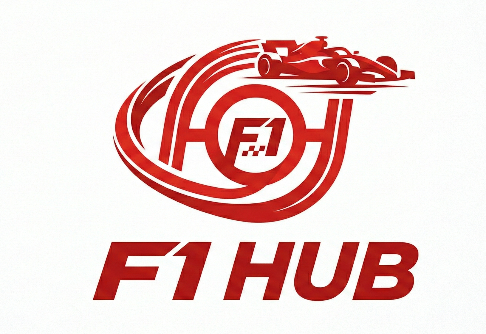

> **"To finish first, first you must finish."** — *Derek Bell*

Welcome to the **F1 Cinematic Hub**, an immersive, fan-made web experience designed for the upcoming **2026 Formula 1 Season**. This hub provides a premium, data-driven experience to explore drivers, teams, and race calendars with cinematic transitions and high-performance optimizations.

---

## Project Gallery

Explore the complete visual experience of the F1 Cinematic Hub.

### Landing and Hero Experience

*Immersive entry with dynamic typography and parallax racing backgrounds.*

### Entry and Loading

*Minimalist startup with the iconic F1 logo reveal and spinning ring.*

---

## The 2026 Grid

### Driver Standings

*A full roster of 24 drivers across 12 teams, featuring portraits and team-themed cards.*

### Constructor Overview
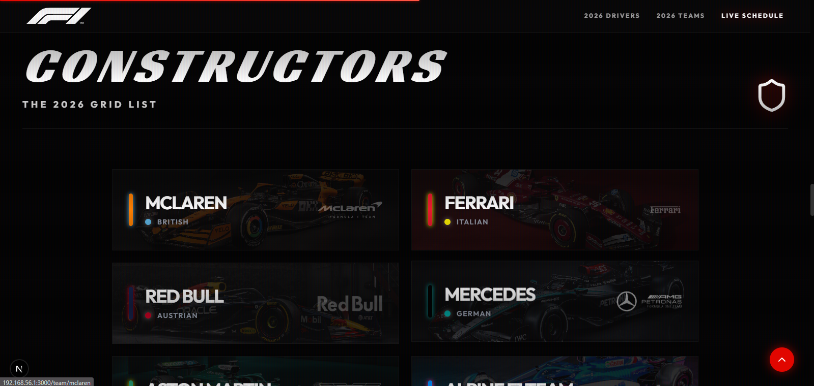
*The complete team list for 2026, including newer entries like Audi, Cadillac, and Zytherion.*

---

## Team Detail Previews
*Each team has a dedicated profile featuring lore, 2026 specifications, and a full driver lineup.*

| McLaren | Ferrari | Red Bull | Mercedes |
| :---: | :---: | :---: | :---: |
| 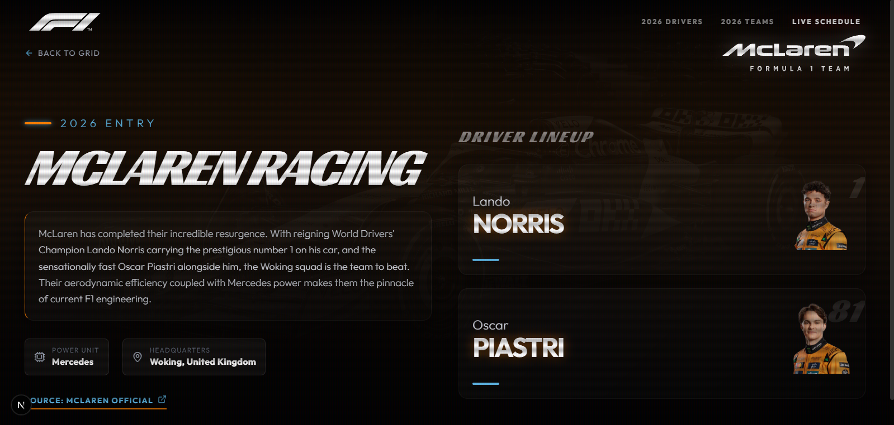 | 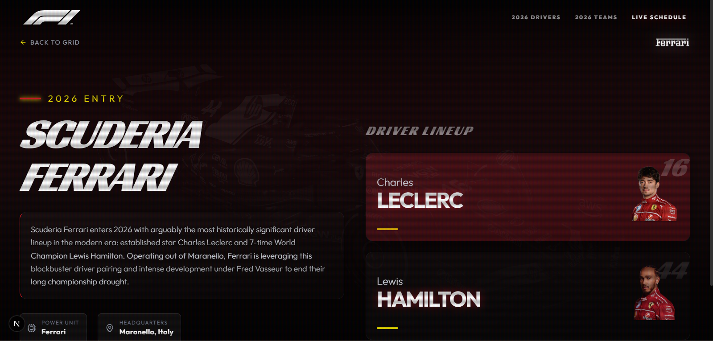 | 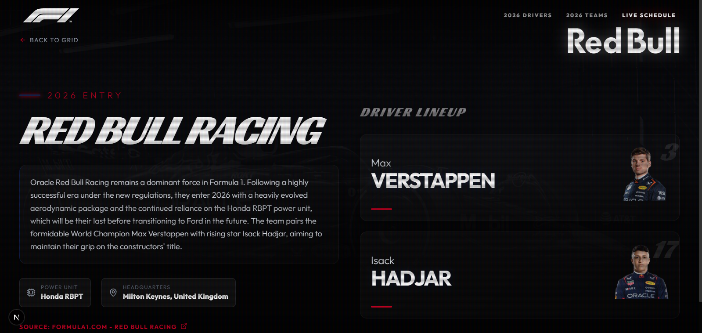 | 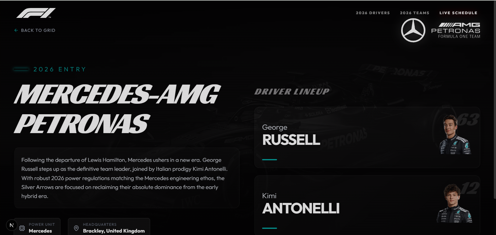 |

| Aston Martin | Alpine | RB F1 Team | Williams |
| :---: | :---: | :---: | :---: |
|  | 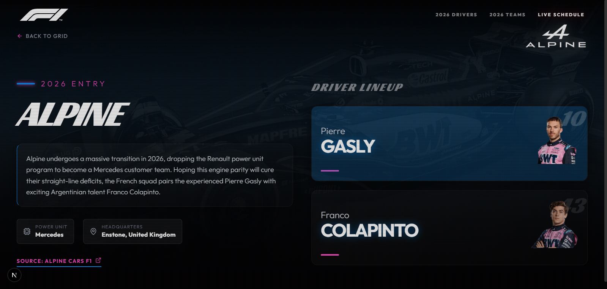 |  | 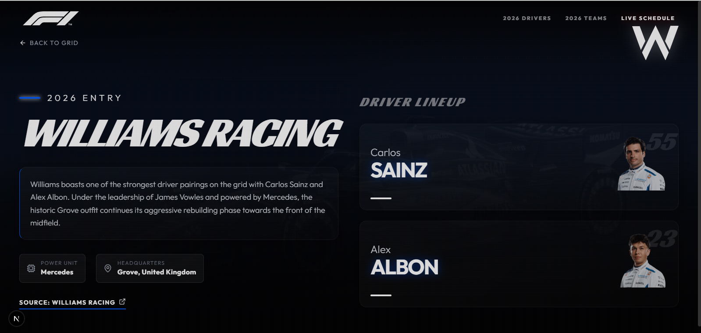 |

| Audi F1 | Haas F1 | Cadillac F1 | Zytherion F1 |
| :---: | :---: | :---: | :---: |
| 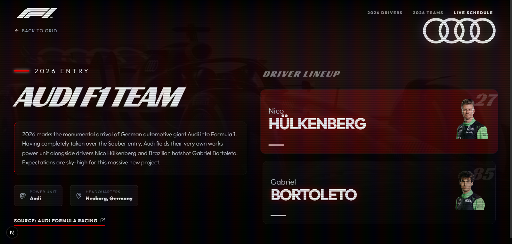 | 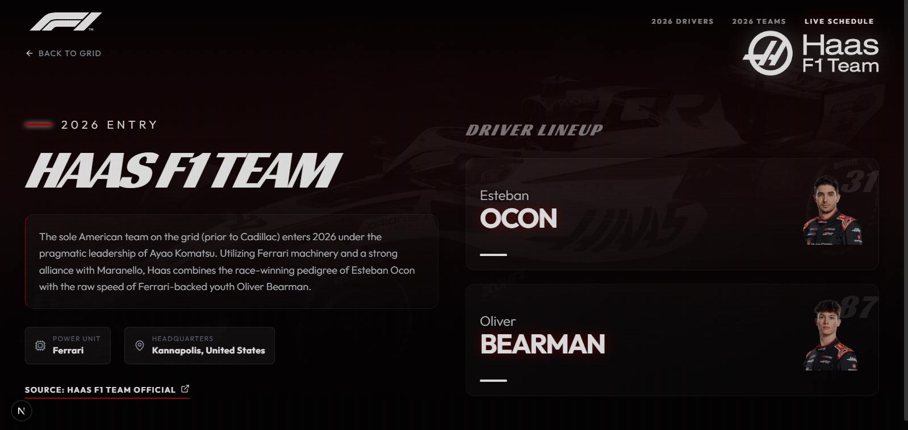 | 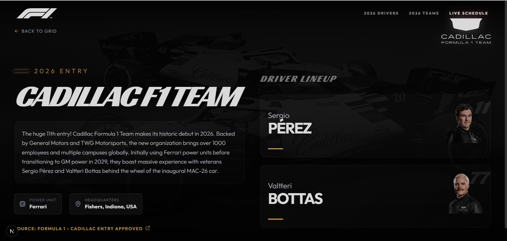 | 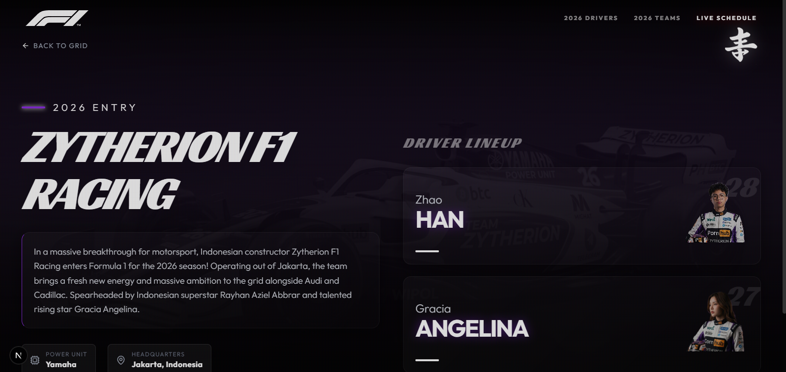 |

---

## Season Insights

### Race Calendar
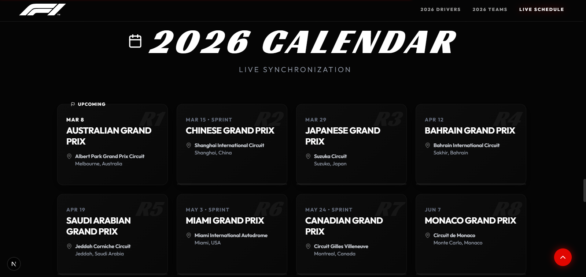
*Live-syncing 2026 race calendar highlighting upcoming Grand Prix events.*

### Statistics and Legacy

*F1 by the numbers: Speed, Scale, and Iconic Wisdom from legends.*

### Cinematic Footer
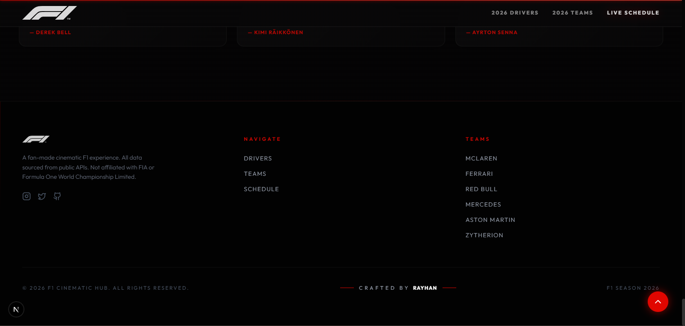
*Premium navigation hub featuring "Crafted by Rayhan" branding.*

---

## The Tech Stack

- **Framework**: Next.js 16 (Turbopack)
- **Styling**: Tailwind CSS v4
- **Animation**: Framer Motion
- **Icons**: Lucide React
- **API**: Jolpi F1 API

---

## Credits

Project crafted with passion by **Rayhan**.

---
*Disclaimer: This is a fan-made project. Not affiliated with the FIA or Formula One World Championship Limited.*
